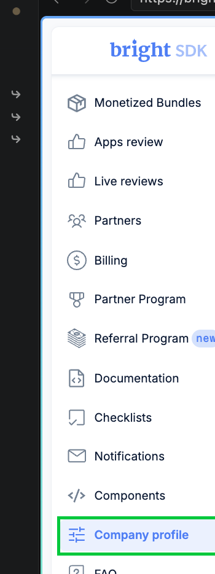
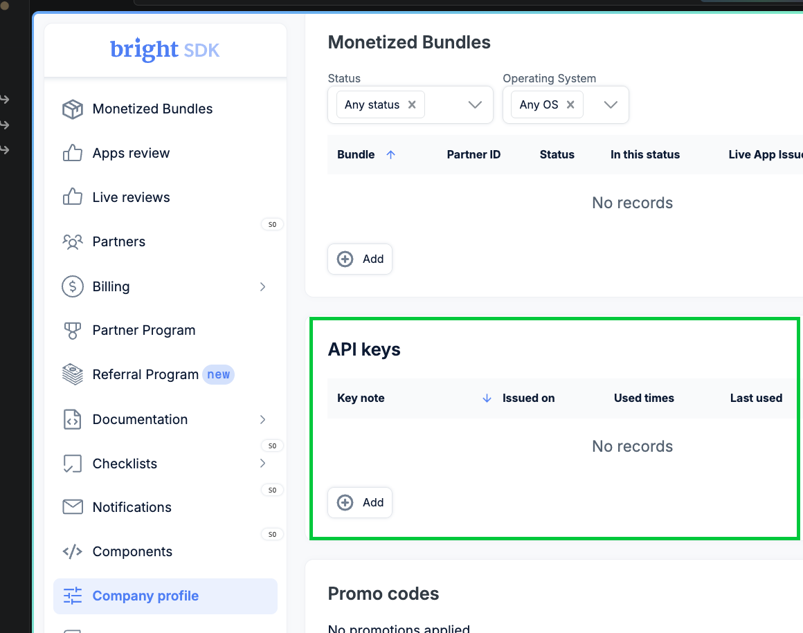
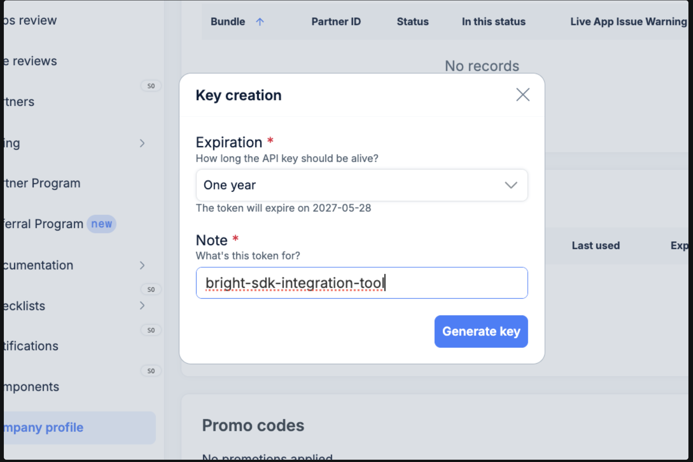
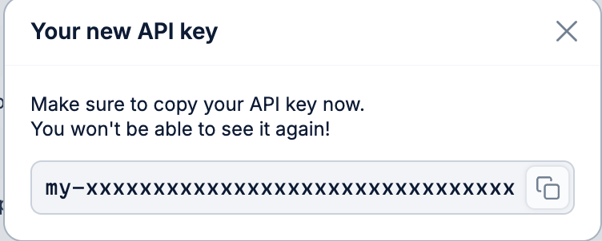

# How to obtain a BrightSDK API key

The Bright SDK Unity Plugin requires a BrightSDK API key to authenticate with the SDK releases API.
Set the key as the `SDK_API_KEY` environment variable before triggering a Unity build.

> **Quick link:** [bright-sdk.com → API keys](https://bright-sdk.com/cp/settings/company_profile#api_keys)

## Steps

### Step 1 — Open Company Profile

Log in to the [BrightData Control Panel](https://brightdata.com) and click **Company profile** in the left sidebar.



### Step 2 — Navigate to API Keys

In the Company profile page, open the **API keys** section.



### Step 3 — Create a new key

Click **Add API key**, give it a descriptive name (e.g. `unity-plugin-ci`), and confirm.



### Step 4 — Copy the key

The key is shown **once** — copy it immediately and store it securely.



## Setting the environment variable

**macOS / Linux**

```bash
export SDK_API_KEY=my-xxxxxxxxxxxxxxxxxxxxxxxxxxxxxxxx
```

Add it to `~/.zshrc` or `~/.bashrc` to persist across sessions.

**Windows (PowerShell)**

```powershell
$env:SDK_API_KEY = "my-xxxxxxxxxxxxxxxxxxxxxxxxxxxxxxxx"
```

To persist for your user (survives reboots):

```powershell
[Environment]::SetEnvironmentVariable("SDK_API_KEY", "my-xxxxxxxxxxxxxxxxxxxxxxxxxxxxxxxx", "User")
```

**Windows (CMD)**

```cmd
set SDK_API_KEY=my-xxxxxxxxxxxxxxxxxxxxxxxxxxxxxxxx
```

To persist for your user (survives reboots):

```cmd
setx SDK_API_KEY "my-xxxxxxxxxxxxxxxxxxxxxxxxxxxxxxxx"
```

**CI / GitHub Actions** — store as a repository secret and reference it in your workflow:

```yaml
env:
  SDK_API_KEY: ${{ secrets.SDK_API_KEY }}
```

> **Security note:** Never commit your API key to source control.
